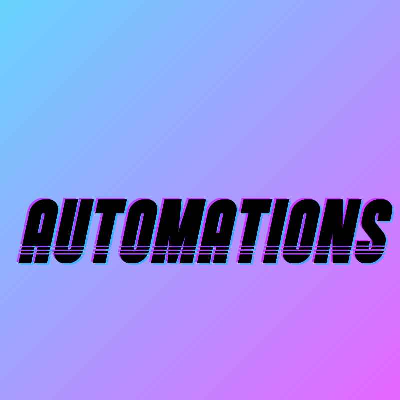
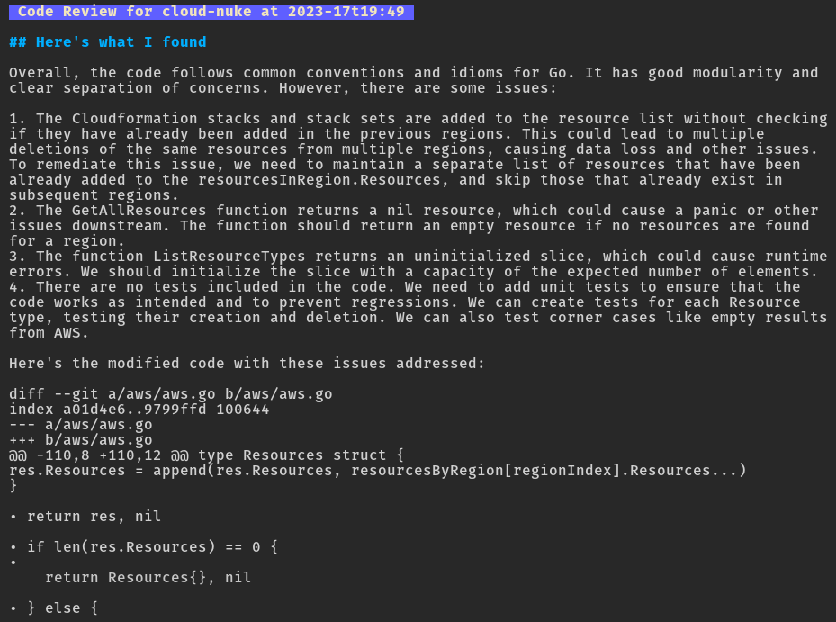

# Automations

Automations are shell scripts I wrote alongside generative AI, that leverage generative AI to make common developer tasks delightful and efficient. 

## Current automations

### `autogit`

autogit's goal is to ensure you're always working with the latest code, because even experienced developers forget to `git pull` at the least opportune times.

[**Read the deep-dive blog post on `autogit`** to learn about everything it can do.](https://www.zackproser.com/blog/autogit-introduction)

### `autoreview`

`autoreview` is a shell script that performs a detailed code review of your stashed git changes. 

Here's an example of a code review you'd get back, right in your terminal, so that you can refer to the review while you fix your code in another buffer:

## Coming soon 

### `autocommitmessage`

Never write "check in latest" ever again. Always get accurate, well-formed git messages that actually record the context of the changes you're making for posterity

## How it works 

Automations are shell scripts that wrap the excellent charm.sh libraries: 

* [mods](https://github.com/charmbracelet/mods)
* [glow](https://github.com/charmbracelet/glow)
