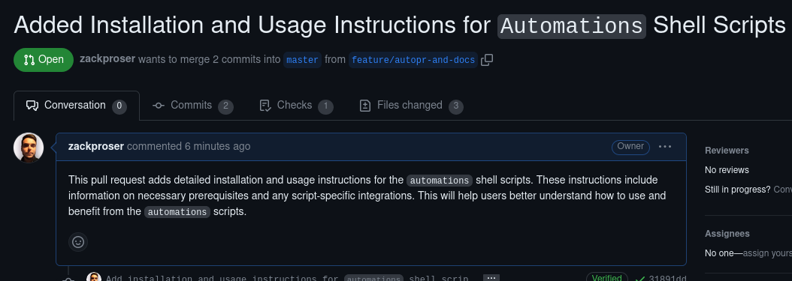

# Automations

Automations are shell scripts I wrote alongside generative AI, that leverage generative AI to make common developer tasks delightful and efficient. 

## Current automations
* [`autogit`](https://github.com/zackproser/autogit)
* [`autoreview`](https://github.com/zackproser/autoreview)
* [`autocommitmessage`](https://github.com/zackproser/autocommitmessage)
* [`autopullrequest`](https://github.com/zackproser/autopullrequest)

## Installation & usage

[Usage guide](./docs/usage.md)

## `autogit`

autogit's goal is to ensure you're always working with the latest code, because even experienced developers forget to `git pull` at the least opportune times.

[**Read the deep-dive blog post on `autogit`** to learn about everything it can do.](https://www.zackproser.com/blog/autogit-introduction)

## `autoreview`

`autoreview` is a shell script that performs a detailed code review of your stashed git changes. 

Here's an example of a code review you'd get back, right in your terminal, so that you can refer to the review while you fix your code in another buffer:

## `autocommitmessage`

Never write "check in latest" ever again. Always get accurate, well-formed git messages that actually record the context of the changes you're making for posterity

## `autopullrequest`

[Example pull request opened by this command.](https://github.com/zackproser/sizeof/pull/2)

Reads all the commit messages for commits that exist in your current branch but not in your default branch. Writes a pull request description and title for you, then uses the `gh` tool to programmatically open the pull request for you. Pairs very nicely with `autocommitmessage`.

Here's an example of a pull request opened by this automation - in fact, I ran it on this codebase itself to open my most recent pr!

